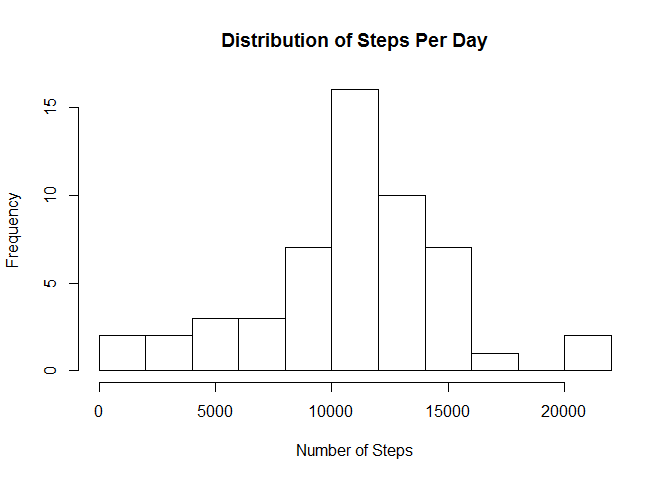
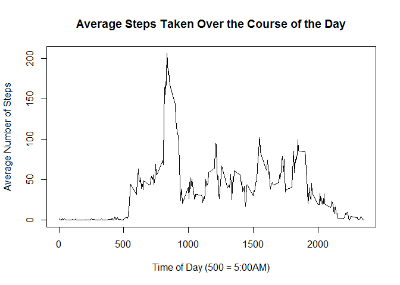
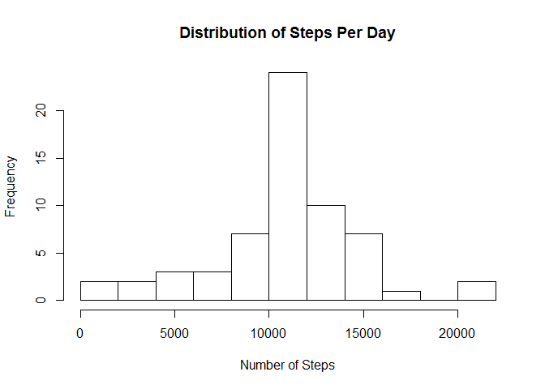
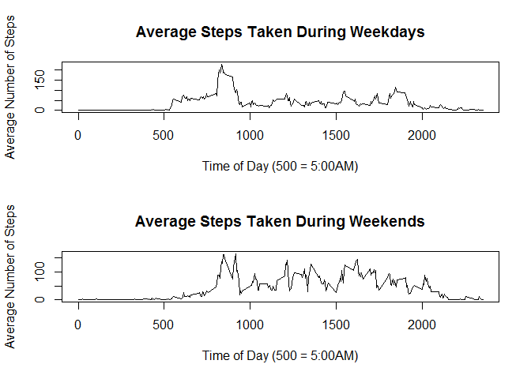

# Reproducible Research: Peer Assessment 1


## Loading and preprocessing the data

```r
activity<-read.csv("activity.csv")
str(activity)
```

```
## 'data.frame':	17568 obs. of  3 variables:
##  $ steps   : int  NA NA NA NA NA NA NA NA NA NA ...
##  $ date    : Factor w/ 61 levels "2012-10-01","2012-10-02",..: 1 1 1 1 1 1 1 1 1 1 ...
##  $ interval: int  0 5 10 15 20 25 30 35 40 45 ...
```

I noticed that steps has some 'NA' values and that date was stored as a factor. So, let's reformat and remove 'NA' values for now.


```r
activity$date <- as.Date(activity$date)
activity <- na.omit(activity)
```

## What is mean total number of steps taken per day?


```r
steps.day <- aggregate(activity$steps,by=list(activity$date),FUN=sum)
hist(steps.day$x,breaks=10,xlab="Number of Steps",main="Distribution of Steps Per Day")
```

<!-- -->

```r
mean(steps.day$x)
```

```
## [1] 10766.19
```

```r
median(steps.day$x)
```

```
## [1] 10765
```


## What is the average daily activity pattern?

```r
steps.int <- aggregate(activity$steps,by=list(activity$interval),FUN=mean)
names(steps.int)<-c("interval","steps")
plot(x=(steps.int$interval),y=steps.int$steps,type="l",
     main="Average Steps Taken Over the Course of the Day",
     xlab="Time of Day (500 = 5:00AM)",
     ylab="Average Number of Steps")
```

<!-- -->

```r
steps.int[which.max(steps.int$steps),"interval"]
```

```
## [1] 835
```


## Imputing missing values


```r
newact<-read.csv("activity.csv")
newact$date <- as.Date(newact$date)

sum(is.na(newact$steps))
```

```
## [1] 2304
```

```r
mact <- merge(x=steps.int, y=newact, by="interval")
head(mact)
```

```
##   interval  steps.x steps.y       date
## 1        0 1.716981      NA 2012-10-01
## 2        0 1.716981       0 2012-11-23
## 3        0 1.716981       0 2012-10-28
## 4        0 1.716981       0 2012-11-06
## 5        0 1.716981       0 2012-11-24
## 6        0 1.716981       0 2012-11-15
```

```r
mact$steps <- ifelse(is.na(mact$steps.y),mact$steps.x,mact$steps.y)
head(mact)
```

```
##   interval  steps.x steps.y       date    steps
## 1        0 1.716981      NA 2012-10-01 1.716981
## 2        0 1.716981       0 2012-11-23 0.000000
## 3        0 1.716981       0 2012-10-28 0.000000
## 4        0 1.716981       0 2012-11-06 0.000000
## 5        0 1.716981       0 2012-11-24 0.000000
## 6        0 1.716981       0 2012-11-15 0.000000
```

```r
# remove unnecessary columns 2 and 3 and reorder:
mact <- mact[,c(-2,-3)][,c(3,2,1)] 

steps.day2 <- aggregate(mact$steps,by=list(mact$date),FUN=sum)
hist(steps.day2$x,breaks=10,xlab="Number of Steps",main="Distribution of Steps Per Day")
```

<!-- -->

```r
mean(steps.day2$x)
```

```
## [1] 10766.19
```

```r
median(steps.day2$x)
```

```
## [1] 10766.19
```


## Are there differences in activity patterns between weekdays and weekends?

```r
mact$day <- as.factor(ifelse(weekdays(mact$date) %in% c("Saturday","Sunday"),"Weekend","Weekday"))

steps.int.wd <- with(mact[mact$day=="Weekday",],
                     aggregate(steps,by=list(interval),FUN=mean))
names(steps.int.wd)<-c("interval","steps")
steps.int.we <- with(mact[mact$day=="Weekend",],
                     aggregate(steps,by=list(interval),FUN=mean))
names(steps.int.we)<-c("interval","steps")
par(mfrow=c(2,1))
with(steps.int.wd,
     plot(x=interval,y=steps,
          type="l",
          main="Average Steps Taken During Weekdays",
          xlab="Time of Day (500 = 5:00AM)",
          ylab="Average Number of Steps"))
with(steps.int.we,
     plot(x=interval,y=steps,
          type="l",
          main="Average Steps Taken During Weekends",
          xlab="Time of Day (500 = 5:00AM)",
          ylab="Average Number of Steps")) 
```

<!-- -->

